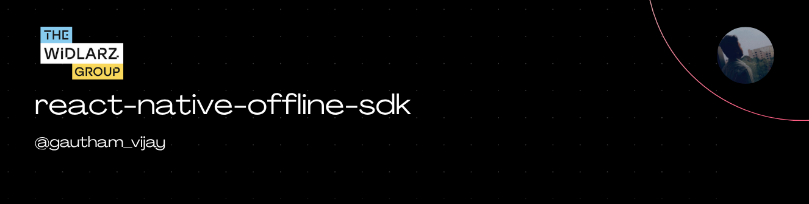

<picture> 
   
</picture>

# React Native Offline Video SDK (Expo Integration)

## 🎥 Overview

This repository contains a complete example of how to integrate **TheWidlarzGroup Offline Video SDK** into a **React Native Expo** application.

The Offline Video SDK enables:

- 🔻 **Offline-first video downloading**
- 🎞️ **Secure, encrypted video playback**
- 📱 **Fast, native-level performance**
- 🚀 **Production-ready integration for real-world apps**

This repo accompanies my sponsored deep-dive video, where I walk through setup, configuration, and best practices.

---

## 🔗 Useful Links

📌 **Signup**
[https://sdk.thewidlarzgroup.com/signup](https://sdk.thewidlarzgroup.com/signup)

📌 **Offline SDK Dashboard**
[https://sdk.thewidlarzgroup.com/offline-sdk](https://sdk.thewidlarzgroup.com/offline-sdk)

📌 **Documentation**
[https://docs.thewidlarzgroup.com/offline-video-sdk/docs/intro](https://docs.thewidlarzgroup.com/offline-video-sdk/docs/intro)

📌 **This Example Repo**
[https://github.com/Gautham495/react-native-video-offline-sdk](https://github.com/Gautham495/react-native-video-offline-sdk)

---

## 📦 Features Demonstrated in This Repo

- 📀 Registering your app with the Offline SDK
- 🔐 Secure SDK key injection
- 📥 Downloading videos to device storage
- 📂 Tracking download progress & file management
- ▶️ Offline playback using a custom player
- 🧱 Native module bridging for both iOS & Android
- ⚙️ Expo plugin configuration
- 🧪 Example UI for testing workflows

---

## 🚀 Getting Started

### 1. Clone this repo

```sh
git clone https://github.com/Gautham495/react-native-video-offline-sdk
cd react-native-video-offline-sdk
```

### 2. Install dependencies

```sh
npm install
```

> Run in the latest **Expo SDK 54+** and **React Native 0.81+**.

---

## ⚙️ Expo Plugin Setup

Add the custom plugin to your Expo app config:

```jsonc
{
  "expo": {
    "plugins": ["./plugins/with-video-stream-downloader"]
  }
}
```

This plugin will:

- Inject the required native dependencies
- Add Android `.aar` libraries
- Configure iOS project files
- Handle permissions
- Auto-link the SDK

---

## 🔑 Add Your Offline SDK Credentials

You can obtain these from your dashboard:

```
https://sdk.thewidlarzgroup.com/offline-sdk

https://sdk.thewidlarzgroup.com/dashboard

```


The example uses a simple configuration wrapper to load these at runtime.

---

## 📥 Downloading a Video (Example)

```ts
import { downloadStream } from "@TheWidlarzGroup/react-native-video-stream-downloader";

await downloadStream("https://your-cdn.com/video.mp4");
```

---

## 🛠 Native Installation Notes

This repo includes:

### ✅ Android setup

- Adds `.aar` native binaries
- Links them via Gradle
- Injects initialization code
- Ensures Hermes compatibility

### ✅ iOS setup

- Installs via Cocoapods / local podspec
- Adds required file permissions
- Automatically configures Xcode project

---

## 📺 Watch the Full Tutorials in YouTube

[About Offline Video SDK](https://youtu.be/4uBlvYOQMI8)

[Implementing Offline Video SDK](https://youtu.be/OvcJr42q0mw)

## 🤖 Download the Android Version

[Android APK](https://expo.dev/artifacts/eas/arhbxhNChNrd5LTA4791QJ.apk)

---

## 🧑‍💻 Author

**Gautham Vijayan**

---